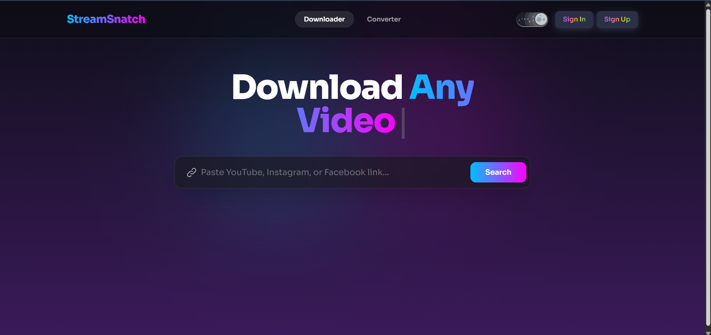

# StreamSnatch

StreamSnatch is a simple, full-stack video downloader and file converter web application. It allows you to download videos from multiple platforms and convert media files between different formats easily.

## Features
- **Video Downloader:** Download videos from YouTube, Instagram, and Facebook.
- **File Converter:** Convert files to MP4, MP3, or MKV.

## Tech Stack
- **Frontend:** React, Tailwind CSS
- **Backend:** Flask (Python)
- **Tools:** FFmpeg, yt-dlp

## Screenshots


## How to Run Locally

### Prerequisites
Make sure you have Node.js, Python 3, and FFmpeg installed on your machine.

### Backend Setup
1. Navigate to the backend folder:
   ```bash
   cd backend
   ```
2. Create and activate a virtual environment:
   ```bash
   python -m venv venv
   # On Windows use: venv\Scripts\activate
   source venv/bin/activate
   ```
3. Install dependencies:
   ```bash
   pip install -r requirements.txt
   ```
4. Start the server:
   ```bash
   python app.py
   ```

### Frontend Setup
1. Navigate to the frontend folder:
   ```bash
   cd frontend
   ```
2. Install dependencies:
   ```bash
   npm install
   ```
3. Start the development server:
   ```bash
   npm run dev
   ```

## Project Structure
```text
StreamSnatch/
├── backend/       # Flask API, yt-dlp logic, and FFmpeg conversion
└── frontend/      # React UI and Tailwind styling
```

## Future Improvements
- User authentication
- Track download history
- Better error handling

## Disclaimer
This tool is for educational purposes only. Please respect the terms of service of the respective platforms and only download content you have the rights or permissions to use.
